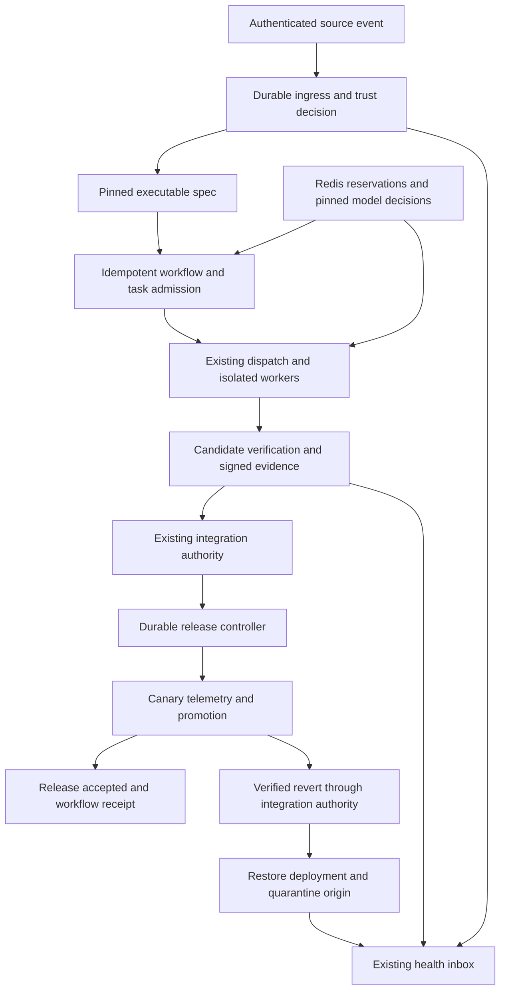

# GasTeam Dark Factory: Product Requirements and Delivery Gates

Document version: 2.0.0. Reviewed: 2026-09-06.

Repository baseline: `86f732ce14f2825a9c52ace3a1d9fdd10489cf70`.

Status: proposed requirements; implementation and qualification gates remain open.

This is the canonical Dark Factory PRD. It incorporates the review and goal-based plan from session `01a074d1-b563-7c41-87e5-769851e49627`, checks those decisions against the current repository, and adds the provider and operational constraints cited below. The previous micro-task roadmap is superseded. Configuration, types, new paths, metrics, and tests described here are proposed contracts, not claims that these features already exist.

## 1. Outcome, scope, and compatibility

GasTeam should turn authorized, sufficiently specified work into a verified change, a deployed release, and a recorded health decision without human prompts in the healthy path. Humans configure authority, acceptance policies, budgets, and deployment targets; exceptions produce durable, actionable escalation. “Dark Factory” describes this operating mode, not a standardized autonomy certification or proof that generated software is defect-free.

The core M0–M11 completion is recorded in [pending work](pending.md), [handoff](handoff.md), and [completion evidence](docs/completion-evidence.md). This PRD does not reopen that work or treat its completion as evidence for Dark Factory readiness.

### 1.1 Required v1 scope

- Authenticated GitHub Issues, PRs, Dependabot alerts with GHSA/CVE provenance, Sentry issue/metric alerts, and a signed generic APM adapter.
- A pinned executable specification before any task admission; deterministic authorization and validation around model-assisted compilation.
- Architecture checks, configured tests, changed TS/JS mutation analysis, configured digital twins, and two independent critics.
- Candidate-bound signed verification evidence through the existing integration authority.
- A durable release controller with signed webhook deployment, Prometheus telemetry, canary observation, verified rollback, and quarantine.
- Atomic fleet reservations and incremental usage in Redis; deterministic model selection and a subscription emergency reserve.
- Fresh-process qualification, audit provenance, operational controls, and staged rollout.

Idle maintenance remains in scope as a separately disabled source: at most one task per project every six hours, only below 25% active worker capacity, with no ready higher-priority work and sufficient routine budget. Dependency and TODO findings are evidence for a spec, not authorization to change code. Enable only after Goal 4; use pinned scanners and the same trust, scope, and admission rules.

### 1.2 Non-goals and unsupported work

V1 does not implement general program correctness proofs, arbitrary-language mutation, unrestricted self-modification, a second merge queue, a second operator inbox, automatic branch-protection bypass, or automatic changes to production credentials and infrastructure policy. Stateful/destructive database migrations and changes that cannot be reversed using an immutable prior artifact require a separate release policy and are quarantined in v1.

A CVE identifier alone is not an actionable vulnerability report. Unscoped public feeds, arbitrary webhook URLs from issue bodies, and unverified provider subscription claims cannot authorize work. Native Datadog and other vendor adapters follow later; v1 APM senders use the documented signed generic contract. Digital twins validate declared contracts, not perfect equivalence to production.

### 1.3 Compatibility contract — DF-01

`darkFactory.enabled` defaults to `false`. Disabled means no listener, Redis/model discovery, ingestion, deployment, or additional acceptance requirement. Existing workflow templates, integration phases, publication grants, and journal replay retain their behavior.

Enablement is project-scoped and requires a validated, immutable policy revision. Existing executions keep their pinned definitions; only newly admitted Dark Factory executions require `canary-accepted`. Safety revocation and disable controls apply immediately at effect boundaries even to old attempts. Re-enabling requires reconciliation, never automatic replay of queued external effects.

In `build` mode, expose verified candidate/check receipts as intermediate results and hold the release step without claiming delivery acceptance. Advancing to a deploying mode requires a new authorized execution referencing those artifacts, fresh candidate verification, and the applicable gate receipts; it cannot silently change the original pinned workflow.

## 2. Existing seams and state authority

| Concern | Current repository seam | Required extension and authority |
| --- | --- | --- |
| Projects and coordinator controls | [coordinator.ts](packages/agent-team/src/coordinator.ts), [projects.ts](packages/agent-team/src/projects.ts) | Add opt-in policy and independent pause reasons under the existing coordinator authority. |
| Local durability | [durable-journal.ts](packages/agent-team/src/durable-journal.ts) | Reuse exclusive ownership, sequential events, validation before append, and sync before acknowledgment. Partial/corrupt journals currently reject replay; do not silently truncate them. |
| Task admission and dispatch | [task-board.ts](packages/agent-team/src/task-board.ts), [dispatch-queue.ts](packages/agent-team/src/dispatch-queue.ts) | Spec admission receipts and economic reservations feed existing revision/generation fencing. |
| Workflow acceptance | [workflows.ts](packages/agent-team/src/workflows.ts), [workflow-runtime.ts](packages/agent-team/src/workflow-runtime.ts) | Extend acceptance/receipt unions with `canary-accepted`; pin the spec and policy in the execution. |
| Verification and merge | [integrations.ts](packages/agent-team/src/integrations.ts), [integration-worker.ts](packages/agent-team/src/integration-worker.ts), [git-integration.ts](packages/agent-team/src/git-integration.ts) | `TeamIntegrations` remains Git authority. Machine evidence satisfies its existing review gate; target movement requires new evidence. |
| Usage | [external-runtime.ts](packages/agent-team/src/external-runtime.ts), [routed-assignment-runtime.ts](packages/agent-team/src/routed-assignment-runtime.ts) | The external completed-turn usage receipt is immutable; the DSH route declares usage unsupported. Add a separate incremental accounting adapter; do not mutate old receipts or infer zero cost. |
| Exceptions and dashboard | [health.ts](packages/agent-team/src/health.ts), [workspace-dashboard.ts](packages/agent-team/src/workspace-dashboard.ts) | Extend existing durable escalations and projections with ingress, verification, release, quota, and budget reasons. |

New host-owned lifecycle stores live under the configured coordinator directory, partitioned by registered project ID: `darkfactory/<projectId>/ingestion.jsonl`, `specs.jsonl`, `admissions.jsonl`, `verification.jsonl`, and `releases.jsonl`. These are proposed filenames. Quarantine is a terminal lifecycle event with references into the health inbox, not another competing task store.

Local JSONL stores have one owning coordinator process. Multi-host operation means separately owned coordinators sharing fleet economics; v1 does not allow two hosts to own the same project, repository/target branch, or deployment environment. Reject duplicate ownership; host takeover requires fencing the old host and reconciling its effects. Redis is authoritative only for fleet decisions, not local workflow or Git state. JSONL fleet decision mirrors are audit records, never an offline admission fallback.

## 3. Threat model and authority boundaries — DF-02

Treat source text, PR code, stack traces, repository comments, retrieved documents, test logs, and all model output as untrusted data. An authenticated webhook proves its transport origin, not that its contents should be executed. An allowlisted repository can still contain a malicious issue or compromised dependency.

The control plane owns policy, service grants, dispatch, evidence signing, Git promotion, deployment credentials, and fleet accounting. Workers and critics cannot edit those objects, set emergency classifications, select executable shell commands, or grant publication. Source instructions must not override system policy. Delimit untrusted prompt sections and constrain outputs, but enforce permissions outside the model: prompt filtering alone is not a security boundary. This follows the layered approach in the [OWASP prompt-injection guidance](https://cheatsheetseries.owasp.org/cheatsheets/LLM_Prompt_Injection_Prevention_Cheat_Sheet.html).

Required controls:

- Worker/test sandboxes expose only their checkout and scoped artifacts; no signing key, deployment token, shared coordinator directory, host socket, cloud metadata endpoint, or inherited host credentials.
- Outbound access uses registered destinations and bounded adapters. Disable arbitrary URL fetching and redirects; resolve and validate destinations to prevent SSRF and DNS rebinding. Dependency fetching uses a controlled cache/allowlist with pinned lockfiles.
- Git worktrees isolate changes but are not security sandboxes. Production mode requires an OS/container boundary with bounded CPU, memory, disk, time, and process-tree termination.
- Canonical paths reject traversal, absolute paths, symlink escapes, Git metadata edits, and cross-project artifact access. Control-plane policy and test-harness paths are denylisted even when a spec has broad allowed paths.
- Publication requires a configured service grant for the exact project, repository, branch, environment, and operation. The host verifies this at every side effect; an automation label is not a deployment credential.
- Secrets resolve from environment variables or absolute configured secret files. Persist only secret references and key IDs. Redact headers, URLs, payloads, test output, and notifications before persistence/export; restricted encrypted artifacts hold any necessary sensitive evidence.
- Revoked authority, unknown state, missing evidence, or exhausted retries produce a durable failure/quarantine outcome. Neither a timeout nor model confidence is success.

## 4. Versioned public contracts — DF-03

Goal 0 implements strict Zod schemas and generated JSON Schema for these contracts under proposed `packages/agent-team/src/darkfactory/contracts/`. This section defines required fields and semantics; it is not an implemented schema package.

All public records carry `schemaVersion: 1`, an immutable `id`, `projectId` when project-scoped, and `policyRevision`. UTC timestamps are RFC 3339 strings; money uses nonnegative integer USD micro-units with explicit pricing currency; counters are bounded safe integers. Digests are algorithm-tagged SHA-256 values, Git commits use the repository's full object-ID format, and artifact references include project identity, media type, size, and content digest. Reject unknown versions, unknown fields, non-finite numbers, duplicate JSON keys, and oversized collections. Lifecycle updates append events with the journal's separate `version`, `sequence`, and expected record revision.

| Contract | Required content and validation |
| --- | --- |
| `InboundEnvelopeV1` | Source adapter/version, registered route, delivery ID, event kind/action, raw-body digest, receive time, provider time when supplied, signing key ID, authentication result, artifact reference. Body digest is computed before parsing; payload storage follows redaction policy. |
| `InboundWorkItemV1` | Envelope ID, source entity ID, `sourceRevision`, repository identity, author and event actor, title, bounded untrusted context, labels, source URL, provenance, trust decision/reasons, lifecycle state, record revision. `sourceRevision` is distinct from `schemaVersion`; deduplication cannot use a nonexistent generic `version`. |
| `ExecutableSpecV1` | Objective, non-goals, invariants with registered check IDs, acceptance scenarios with fixture/assertion IDs, allowed paths, required capabilities, risk class `low/medium/high/critical`, trusted priority, source provenance, base commit, compiler/prompt revision, policy/rules digest, spec digest. At least one runnable acceptance scenario; prose alone is insufficient. |
| `VerificationEvidenceV1` | Project/task/workflow/attempt/generation, source/target/candidate commits, candidate tree digest, spec/policy/toolchain digests, stage results and artifact digests, independent critic records, timestamps/expiry, decision, signer key ID, evidence hash and Ed25519 signature. Evidence for a batch enumerates every member and the final combined tree. |
| `ReleaseRecordV1` | Project/repository/environment, workflow and integration receipt IDs, contributing attempts/specs/evidence, commit and immutable artifact digest, prior accepted release/artifact, policy snapshot, state/revision/fencing token, operation intents/receipts, canary start/deadlines, telemetry references, rollback/diagnostic references. |
| `TelemetryVerdictV1` | Release/deployment/artifact identity, policy digest, baseline and sample windows, request/error counts, latency histogram reference/p99, freshness, breach count, result `HEALTHY/ANOMALY_DETECTED/INSUFFICIENT_DATA`, reason codes, signed collector attestation. |
| `UsageEventV1` | Fleet/host/project/attempt/generation, provider/account/model, request ID, monotonic stream sequence, pricing revision, usage time, input/cache/output/reasoning counts with provider counting semantics, billed cost, reservation ID, event digest, optional compression estimates. Corrections reference the original event; originals are immutable. |
| `ProviderQuotaV1` | Fleet/account/pool, unit `tokens/requests/credits`, total and observed remaining allowance, window/reset, observed/expiry timestamps, adapter and source provenance, authoritative/manual status. Pending reservations are accounted separately and atomically; unknown is not zero or unlimited. |
| `ModelRoleAssignmentV1` | Role, provider/deployment/model version, catalog revision/digest, normalized capabilities, benchmark and health evidence, pricing revision, ordered fallback chain, quota/reservation decision, assignment timestamp. Pin to an attempt before its first paid request. |

Supporting strict contracts are required for admission receipts, deployment requests/status/callbacks, pricing snapshots, reservations, compiler outcomes, critic outcomes, and operational events. IDs and project references must round-trip through existing RPC codecs without exposing secrets.

Spec and policy digests use canonical JSON with their own digest/signature fields excluded; artifact digests cover original bytes. An admission pins those exact payloads, not a mutable file path. Cross-record validation checks project identity, referenced revisions, legal state transitions, unique operation keys, and terminal-state immutability in addition to validating each record's shape.

## 5. Trusted ingestion and executable intent

### 5.1 Ingress service and provider adapters — DF-04

Provide an opt-in host plugin with `POST /darkfactory/v1/ingress/<source>/<routeId>`. Route IDs map to pre-registered projects; neither request bodies nor URL-supplied repository paths choose authority. Non-test deployments use TLS at a configured trusted gateway; bind the application listener to loopback by default.

Read a bounded raw body, validate authentication in constant time, then parse and normalize. Defaults: 1 MiB body, 16 KiB headers, no compressed request bodies, 60 requests/minute per registered route with burst 20, 10,000 pending records/project, and a configured disk high-water mark. Apply an edge/global limit before authentication and a route limit afterwards. Return `413` for size limits, `429` with retry guidance for rate limits, and `503` when durable storage/queue capacity is unavailable. Invalid signatures return `401`; store only bounded security metadata, not attacker-controlled raw content.

Persist a received event or authenticated quarantine decision before returning `202`; known duplicates return `200` with the existing receipt identity. HTTP receipt acknowledges durable custody, not task admission or release acceptance. Target p99 response time is 500 ms at configured load. GitHub requires responses within ten seconds; Sentry documents a one-second deadline, so slow compilers and network enrichment must run after the durable receipt. See [GitHub webhook practices](https://docs.github.com/en/webhooks/using-webhooks/best-practices-for-using-webhooks) and [Sentry's webhook contract](https://github.com/getsentry/sentry-docs/blob/master/docs/integrations/integration-platform/webhooks.mdx).

| Source | Authentication and supported normalization | Unattended authorization |
| --- | --- | --- |
| GitHub Issues | Raw-body HMAC-SHA256 in `X-Hub-Signature-256`; delivery ID plus body digest. Handle `opened`, `edited`, `labeled`, `reopened`; closing/unlabeling invalidates pending authority. | Registered installation/repository IDs, allowlisted author and initiating actor, current `darkfactory:execute` label. Re-fetch current entity and label authorization before admission. |
| GitHub PRs | Same transport; normalize `opened`, `synchronize`, `edited`, `labeled`, `reopened`; pin base/head repository IDs and commits. | Same checks; fork content stays untrusted. A PR is a proposed input change, never automatic approval of its code or permission to run its CI with secrets. |
| Dependabot/CVE | GitHub `dependabot_alert` creation/reopen/reintroduction events; pin alert ID, dependency/lockfile, affected range, available fix, GHSA and CVE identifiers when present. Closing/dismissal updates current evidence. | Allowlisted installation/repository and a host-configured automation policy carrying `darkfactory:execute`. Alerts have no issue-label requirement to invent; the trusted policy supplies the equivalent authorization. Verify actual exposure and a compatible fix. |
| Sentry | Integration Platform HMAC-SHA256 with client secret; retain request ID, resource, timestamp and body digest. Normalize issue/event alerts and metric alerts; retain environment, release, exception and bounded frames when available. | Registered installation/org/project, allowed actor/rule, production environment mapping, host-configured automation label. Missing frames are permissible; missing reproduction evidence still blocks compilation. |
| Generic APM | GasTeam HMAC-SHA256 over a domain-separated string containing method, registered path, key ID, delivery ID, Unix timestamp, and raw-body SHA-256. All fields use fixed newline separation; validate their formats before signing/verifying. | Registered sender/project/environment and rule-to-automation-label mapping. Schema covers alert fingerprint, observation window, commit/release, metrics and evidence references. |

GitHub signs payload bytes; do not reserialize JSON to validate the signature. Its documented signature does not supply an authenticated delivery timestamp. Sentry exposes a timestamp header, but its documented signature example authenticates the payload; do not assume that timestamp header is cryptographically bound. Require a five-minute clock window for the generic signed contract. For native providers, use body-digest replay protection and provider-authenticated entity reconciliation; a local receive timestamp cannot establish original freshness. See [GitHub signature validation](https://docs.github.com/en/webhooks/using-webhooks/validating-webhook-deliveries), [GitHub event contracts](https://docs.github.com/en/webhooks/webhook-events-and-payloads), and [Sentry webhook headers/signing](https://github.com/getsentry/sentry-docs/blob/master/docs/integrations/integration-platform/webhooks.mdx).

Persist two distinct dedupe identities: transport `(source, route, deliveryId)` plus `(source, route, bodyDigest)`, and work `(project, source, sourceEntityId, sourceRevision)`. Derive source revision from the authoritative entity revision and a digest of execution-relevant fields; include PR head SHA. Same delivery ID/different body is quarantined. Same body/new delivery ID cannot create new work. Legitimate redelivery returns the existing receipt without changing its lifecycle. Duplicate observations are audited; the original valid item is not quarantined merely because it was retried.

Keep compact dedupe tombstones for the project's lifetime. On a later entity revision, revalidate trust and compile a new immutable spec. If prior work is active, quarantine the new revision as `SOURCE_CHANGED` and pause pending publication until it is reconciled; do not silently mutate an in-flight spec. A provider API outage leaves trust unresolved and cannot admit work. A bounded reconciliation job checks missed deliveries/current entity changes every five minutes using a durable cursor and overlapping lookback, charging API rate limits; do not depend on automatic GitHub redelivery.

### 5.2 Lifecycle and crash-safe admission — DF-05

Normal progression:

`received → trusted → compiled → admitted → acknowledged`

Any nonterminal item can become `quarantined` with a typed reason and evidence reference. Here `acknowledged` means all planned task/workflow records are durably confirmed, not that the source HTTP request is still open. Observe-only mode stops after the trust decision and never compiles or dispatches paid work.

Before task creation, append an admission intent containing deterministic workflow/task IDs, the complete pinned spec/template, and the source dedupe key. Create missing records through existing CAS APIs, compare existing records against pinned inputs, append an admission receipt, then acknowledge the item. On restart, reconcile each intent against those IDs. Conflicting content is quarantined; a crash between journals cannot produce a second workflow.

Enrichment is read-only and limited to registered provider APIs and repository snapshots. Untrusted titles cannot become commands, filesystem paths, credentials, role assignments, or emergency grants.

### 5.3 Spec compiler — DF-06

The compiler returns exactly one typed outcome: `COMPILED`, `AMBIGUOUS`, `CONFLICTING`, `INSUFFICIENT_EVIDENCE`, or `UNSUPPORTED`, with source references and reasons. Only `COMPILED` passing host schema, capability, scope, and invariant validation is admissible.

Model-assisted compilation proposes a spec; the host binds its authority and checks. Acceptance scenarios reference registered fixture/assertion definitions and bounded command IDs. Natural-language invariants without an available executable check produce `UNSUPPORTED`. Reproduction evidence must identify observable expected/actual behavior; models cannot invent it. High/critical work and changes touching authorization, accounting, deployment control, or signing policy are quarantined by default unless a preconfigured purpose-specific policy permits that exact class.

Allow one schema-repair attempt for malformed compiler output; ambiguity/conflict is not solved by repeatedly sampling until the model agrees. Pin spec digest, source revision, base commit, rules, toolchain, compiler/model assignment, prompt revision, and workflow definition. Generate reproduction, implementation, machine verification, integration, and release acceptance steps using the existing workflow engine. No issue-to-DAG shortcut remains.

## 6. Machine-only verification

### 6.1 Architecture and path guard — DF-07

Before dispatch, validate scope and check availability; before submission and again on the integration candidate, validate actual changes. Use the TypeScript compiler API with the locked toolchain version for TS/JS/TSX/JSX parsing and module resolution. Inspect imports, exports, literal `require`, dynamic imports, aliases and cross-package edges; unsupported computed imports in governed paths fail closed. Regex is not an AST parser. See the [TypeScript compiler API](https://github.com/microsoft/TypeScript/wiki/Using-the-Compiler-API).

Pin source base `B`, worker source `S`, current target `T`, and integrated candidate `C`. Check authored changes `B..S` and promotion changes `T..C`; run candidate checks against `C`. Enumerate changes with NUL-delimited Git output and rename detection; validate both old and new rename paths, deletions, modes, and tracked symlinks. Enforce limits on untracked/generated outputs too. Resolve filesystem paths without following an escape outside the sandbox.

Generated/binary files are never silently ignored: require an explicit path policy and reproducibility/artifact check, and record mutation applicability separately. Test configuration, trusted assertions, policy files, and guard code cannot be weakened by the candidate being judged. Candidate-added tests supplement a host-pinned harness.

A moving target invalidates the candidate-bound stages and review receipt. Preserve old evidence in existing workflow candidate history, rebuild against the new target, and rerun verification with the existing bounded target retry mechanism. V1 disables merge batching for Dark Factory changes; future batching must verify the final combined artifact and bind every contributing spec before release.

### 6.2 Mutation policy and isolated execution — DF-08

V1 generates deterministic mutations only on changed executable TS/JS AST nodes in `T..C`: equality/relational/logical operators and type-compatible boolean/literal returns. Sort sites by path, span, operator ID; select up to 20 across changed files using a recorded deterministic round-robin selection. Record all eligible and selected counts; sampled mutation does not prove all changed logic is tested.

Run the clean candidate twice with the pinned test harness first. Divergent baseline results yield `FLAKY_BASELINE`, not a successful retry. Each mutant gets a separate disposable candidate worktree and sandbox; never patch the worker or target checkout in place.

Classify each selected mutant as `KILLED`, `SURVIVED`, `NO_COVERAGE`, `INVALID`, `TIMEOUT`, or `INFRA_ERROR`. Only a reproducible test assertion failure counts as killed. Run that killing test once more before recording a kill. An unrelated crash, compile failure, or timeout is not a kill. Any timeout/infrastructure error makes the stage inconclusive and blocks acceptance; allow one infrastructure retry, then quarantine.

For resolved valid mutants, `score = killed / (killed + survived + noCoverage)`; require `score >= 2/3`, with no percentage rounding. Invalid mutants are reported and replaced from remaining eligible sites within the cap. Zero valid mutants in changed executable code yields `INSUFFICIENT_EVIDENCE`. A docs-only/non-executable change may record `NOT_APPLICABLE` only through a pinned applicability rule. Equivalent-mutant claims from models never remove a survivor automatically; policy exceptions must predate the attempt and identify the exact site/operator.

This intentionally differs from Stryker's default treatment of timeouts as detected mutants. Stryker also distinguishes invalid, uncovered, and surviving mutants and documents the difficulty of equivalent mutants; these are reasons to preserve detailed outcomes rather than report a single misleading percentage. See [mutant states](https://stryker-mutator.io/docs/mutation-testing-elements/mutant-states-and-metrics/) and [equivalent mutants](https://stryker-mutator.io/docs/mutation-testing-elements/equivalent-mutants/).

Defaults: one mutant concurrently per attempt, 120 seconds per mutant, 20 minutes for the mutation stage, 10 minutes per configured test command, and 5 seconds termination grace. Persist sandbox ownership, attempt/generation, worktree path, and process identity before execution. On timeout terminate the process group/container, escalate to forced termination, confirm exit, and remove only its owned resources. On cold start reap abandoned sandboxes after fencing their owners. Exit handlers cannot guarantee cleanup after SIGKILL; qualification must exercise the restart reaper.

### 6.3 Digital twins and critics — DF-09

A twin is a pinned contract fixture bundle with image/tool digest, seeded test data, expected requests/responses, readiness check, and a five-minute lifecycle deadline. V1 uses a configured containerized HTTP stub and local fixture services; no production credentials. Bind ports atomically on loopback, record ownership, deny external side effects, and reuse the sandbox reaper. If the spec requires a twin and its contract is missing/stale, fail; a spec with no external dependency records an explicit `NOT_APPLICABLE` result.

Run two critic evaluations in independent attempts with separate contexts. Both receive the same immutable spec, diff, complete evidence references, and rubric; neither sees the other's answer or worker reasoning before committing a verdict. Choose a different model/provider for the second critic whenever an eligible healthy option exists. Production requires that diversity; same-model dual evaluation is permitted only in a non-deploying qualification mode with a recorded diversity deficit.

Each result contains `ACCEPT/REJECT/INSUFFICIENT_EVIDENCE`, confidence in [0,1], criterion coverage, and defects with severity, location, evidence and reproduction steps when reproducible. A sound security objection need not execute an exploit to block. Malformed output or unavailable evidence blocks; never coerce it into acceptance.

Acceptance requires both `ACCEPT`, both confidence >= 0.8, every acceptance criterion covered, and no HIGH/CRITICAL defect. Self-reported confidence is a policy threshold, not calibrated correctness probability. Allow at most two repair cycles per spec, charged against the original total budget; changed code invalidates prior results. No majority voting, selectively discarded critics, or retries solely to obtain a favorable answer.

### 6.4 Evidence and integration review gate — DF-10

Stage order: scope/architecture → clean tests → required twins → mutations → independent critics → signing. Stop on hard failure. Record passed/failed/inconclusive/not-applicable stages, command/fixture revisions, start/end times, exit conditions, logs and artifact digests.

Use RFC 8785 JSON Canonicalization Scheme for the unsigned evidence payload. Compute SHA-256 over its canonical UTF-8 bytes. Sign a domain-separated message containing `gasteam/verification-evidence/v1` and that hash with Ed25519; include signer key ID in the hashed payload, and place hash/signature outside it. Strictly validate before canonicalization; arbitrary JSON serialization is not an interchangeable signing format. See [RFC 8785](https://datatracker.ietf.org/doc/html/rfc8785).

The host signer is isolated from workers and signs only complete host-validated evidence. The integration gate recomputes artifact/evidence digests, verifies against project-scoped trusted public keys, checks expiry (default one hour), revocation, and all project/task/attempt/generation/commit/spec bindings. Signatures authenticate evidence origin and integrity, not the truth of a model verdict.

Identical valid evidence can be re-read for the same pending candidate after a crash; it cannot authorize a different candidate, generation, project, release environment, or second publication. Preserve evidence hashes in integration/release receipts. Pin artifact provenance from candidate tree through build recipe and immutable deployed digest; a commit SHA alone cannot identify rebuilt mutable artifacts.

## 7. Canary delivery and recovery

### 7.1 Release lifecycle and authority — DF-11

A merged integration receipt idempotently creates one release per `(project, environment, integrationReceiptId)`. The separate release journal owns:

`queued → deploying → observing → accepted`

Before acceptance, anomaly/recovery paths are `deploying/observing → rollback_queued → rolled_back`. Known failures with no external effect may become `failed`; uncertain effects and violated authority become `quarantined`. Neither is accepted. Preserve the last observed deployment and unresolved operation so quarantining does not falsely claim that traffic is safe.

One release owns an environment at a time through completion or resolved rollback. Queue later merges and deploy each exact artifact, never “latest main.” Share no production canary environment between project owners. Record operation intent and fencing token before every remote mutation, then the authenticated receipt. Reconcile status before retrying any operation whose response was lost.

Only an accepted release emits a `canary-accepted` completion receipt referencing the release, artifact, integration and telemetry evidence. Dark Factory code tasks/batches cannot report final acceptance at `merged`. A rolled-back attempt is quarantined and its workflow fails; an internal diagnostic task does not convert the original failure to success.

### 7.2 Deployment and telemetry adapters — DF-12

Ship a generic signed webhook deployment protocol first, behind an adapter with `preflight`, `deployCanary`, `status`, `promote`, `withdrawCanary`, and `deployRollback` operations. Implementations must prove idempotency and status lookup for a client-supplied operation key; endpoints that merely trigger a job without lookup/deduplication are observe-only.

Each request/callback binds protocol version, key ID, method/path, project, environment, release/operation ID, fencing token, timestamp, commit, artifact digest, expected prior deployment, and body hash. Use the generic signed framing from ingress; validate TLS, signatures, five-minute freshness, identity, and monotonic provider status revisions. Same key/different parameters is a conflict. Late duplicate callbacks cannot advance terminal releases.

Preflight checks credentials, service grants, protected-branch/environment rules, artifact availability, telemetry queries, prior accepted artifact, and adapter capabilities. Missing prerequisites quarantine before deployment. Do not assume a GitHub Actions/Argo endpoint natively speaks this protocol; a version-pinned bridge must implement and pass it.

Before the first factory release, register the existing stable deployment as an imported baseline with an authorized receipt, immutable artifact digest, provider status, and qualifying health evidence. This setup action supplies rollback provenance without pretending the factory built the baseline. Both the signed request and callback put their signatures in headers, outside the hashed body.

Defaults: 10-second HTTP request deadline, at most three submissions of the same operation key with 1/5/25-second backoff, bounded jitter persisted with the next-attempt time, and a ten-minute deployment completion deadline. Retry transport/429/5xx only after status lookup; authentication/authorization/schema errors do not retry. At deadline, reconcile; if status remains unknown, quarantine and freeze the environment. Never start another deployment to resolve uncertainty.

A Prometheus-compatible collector queries a configured HTTPS API using fixed, project-scoped query templates. It validates metric identity and freshness and signs normalized `TelemetryVerdictV1` snapshots with a telemetry-specific key. Prometheus itself is not assumed to sign responses. Retain bounded query-result artifacts and query revision; missing series, NaN, scrape gaps, counter resets that cannot be reconciled, and deployment label mismatches yield insufficient data.

### 7.3 Quantitative canary policy — DF-13

Proposed defaults below require explicit project adoption before production. They are initial policy values, not universal service SLOs.

| Setting | Default |
| --- | --- |
| Canary traffic | 5%; stable artifact serves the remaining traffic |
| Baseline | 15-minute window immediately before deployment, same service/route cohort |
| Poll/sample window | Poll every 60 seconds; evaluate non-overlapping one-minute windows |
| Minimum evidence | 100 requests per evaluated canary/baseline minute; 1,000 requests total in each complete observation/baseline |
| Freshness | Newest sample <= 120 seconds old; all required windows complete |
| Error thresholds | Absolute rate 1%; relative increase 25% with minimum absolute increase 0.2 percentage points |
| Latency thresholds | p99 > 1,000 ms; relative increase 25% with minimum absolute increase 100 ms |
| Breach persistence | Three consecutive qualifying anomalous windows |
| Canary observation | At least 15 qualifying minutes; maximum wall time 30 minutes |
| Final promotion | Promote the same artifact to 100%; require five further qualifying healthy minutes, maximum ten minutes |

Let `eC` and `eB` be error/request ratios. An error breach is `eC > 0.01` OR `(eB > 0 AND eC > 1.25 * eB AND eC - eB >= 0.002)`. With zero baseline errors, the relative branch is disabled and the absolute threshold remains active. Latency uses the analogous absolute threshold and relative-plus-absolute delta. A window breaches if either metric breaches. Persist each evaluated window key and counter so polls/restarts cannot count it twice.

Do not average instance p99 values. Aggregate compatible histograms first and derive the quantile; incompatible/missing distributions yield insufficient data. This follows [Prometheus histogram guidance](https://prometheus.io/docs/practices/histograms/).

Insufficient windows do not count as healthy, reset the consecutive-breach counter, and do not extend the persisted maximum wall deadline. A healthy window resets the counter. Three consecutive breaches trigger rollback. Acceptance requires the full minimum duration/sample count and no breach in the final three qualifying windows of each observation phase. At the insufficient-data deadline, withdraw canary exposure, enter recovery, and escalate `TELEMETRY_INSUFFICIENT`; absence of traffic is never acceptance. Provider-reported deployment failure bypasses metric sample thresholds and triggers recovery.

### 7.4 Verified rollback — DF-14

On an anomaly, persist `rollback_queued`, freeze subsequent releases for the component, and idempotently withdraw canary traffic to the recorded stable artifact immediately. Traffic withdrawal is containment, not evidence that source rollback has completed.

The containment adapter must also restore the prior artifact after full promotion, when traffic is no longer split. This operation uses its own persisted idempotency key and expected live deployment; if the provider cannot prove restoration, report unresolved exposure and freeze the environment.

Create a revert in a new owned worktree based on the current target. For a non-merge commit use `git revert --no-commit <validated-sha>`. For a merge commit, use `--mainline <validated-parent-number>` derived from the integration receipt. Inspect the resulting diff, commit with the rollback message, verify the candidate, and submit it through the normal integration authority. The `-m` option selects a merge parent; it does not set a commit message. See [git-revert](https://git-scm.com/docs/git-revert).

The revert must remove only the originating integration change and preserve later accepted work. Pin a host-generated recovery spec with scope and restoration assertions; do not reuse the failed candidate's evidence. Check target movement using normal fencing/re-verification. Branch protection remains in force; only the existing authorized promotion/push path publishes the revert. No direct target edit, force-push, or speculative reverse patch.

Build and deploy the verified revert artifact with a distinct idempotency key, and require five qualifying healthy minutes before `rolled_back`. Persist origin quarantine plus exactly one high-priority diagnostic task keyed by release ID. Diagnostic context includes source/spec/candidate, previous accepted release, telemetry, tests, critics, and rollback evidence; emergency authority comes from the release controller.

Rollback conflicts, missing merge ancestry, unavailable prior artifact, unknown deployment status, or failed rollback verification freeze the environment and escalate. A rollback deployment failure does not recursively trigger another automatic rollback. Two consecutive release rollbacks on the same component open a circuit breaker; only an authorized policy action after diagnosis reopens it. Automatic containment may remain safe while source restoration is blocked; report both facts.

## 8. Fleet economics and model governance

### 8.1 Redis authority, reservations, and accounting — DF-15

Redis is the single fleet admission/accounting authority. Use atomic server-side functions/scripts to deduplicate usage and reserve/check fleet, project, host, account and subscription limits together. All keys touched by a decision use one fleet hash tag if Redis Cluster is introduced. A local JSONL audit mirror records immutable decisions and IDs; it cannot authorize dispatch when Redis is unavailable.

V1 deployment uses a dedicated single writable Redis primary with AOF `appendfsync always`, `noeviction`, restricted ACLs/TLS, monitored disk space and explicit recovery. Automatic promotion of a potentially stale replica is disabled. Redis replication is asynchronous by default, and `WAIT` does not make failover strongly consistent; therefore no unconditional “cannot overspend after any failover” claim is allowed. See [Redis replication and consistency limits](https://redis.io/docs/latest/operate/oss_and_stack/management/replication/).

Before a paid request, reserve its bounded maximum input/output/reasoning cost plus quota consumption under a pinned pricing snapshot. An attempt envelope bounds all requests, compiler/critic calls, health probes, repairs and failovers. Set provider-side token/time/request ceilings and mediate every paid call. If an adapter cannot bound/account for spend or bypasses the gateway, it is ineligible for strict fleet mode. Subscription fixed fees count in cost reporting; “zero marginal token charge” does not mean zero total cost.

Reconcile each usage event into its reservation exactly once. Retries keep the same event key/digest; conflicting duplicates quarantine. Out-of-order events persist with gap tracking; sequence gaps block releasing the remaining reservation. Normalize cumulative provider receipts to incremental deltas at the adapter and reconcile terminal totals without double-counting cached/reasoning tokens. Unknown usage retains the worst-case reserve; model-reported token counts are not billing authority.

Reservations have ownership/fencing and a reconciliation deadline, not a TTL that returns money automatically. Release unused funds only after proof that the attempt/request never started or has terminated and all usage is accounted. Timeouts, disconnected workers and provider loss retain exposure. Late usage posts to its original accounting window; UTC day/month rollover does not erase unresolved reservations.

Routine admissions must keep `settledSpend + outstandingReservations + proposedReserve <= 95%` of every configured cap. At the watermark, add a durable `budget` pause reason. Typed emergencies may use the remaining configured financial headroom up to 100%; manual/safety pauses still block them. This economic recovery lane is explicitly configured before rollout. No financial cap is bypassed for emergency work.

Use independent pause reasons `manual`, `safety`, `budget`, `quota`, and `catalog`; clearing one never clears another. Redis failure blocks new paid requests fleet-wide; work already inside an accounted reservation may finish within its enforced ceiling. A Redis restart/epoch change halts admissions until the old authority is fenced and reservations/usage reconcile. If recovery completeness is unknown, mark remaining capacity unavailable rather than reconstruct spend from an incomplete local mirror.

The enforceable guarantee is bounded admission under a healthy authoritative ledger and fully mediated requests. Provider misbilling or lost authoritative storage is detected/escalated; it is not concealed behind an impossible exactly-once spend promise.

### 8.2 Subscription quotas and reserve — DF-16

Quota adapters must obtain allowance, units, rolling/calendar windows, resets and freshness from a documented authenticated provider endpoint for the configured account. If no such endpoint exists, that subscription is unavailable for unattended routing in v1. An operator-entered snapshot may be used only in a non-production fixture mode, with expiry and provenance. Never scrape interactive account pages or infer quota from a model name.

Default quota TTL is five minutes, shortened when a provider reset/window requires it. Before reserving, atomically deduct local outstanding reservations and usage not yet reflected in the provider snapshot; adapters must define the snapshot watermark to prevent double subtraction or regained phantom capacity. All limiting windows/pools must pass. Stale/missing/contradictory data blocks that pool.

Routine routing order is configured primary subscription → ordered alternative subscriptions → explicitly enabled metered deployments. A routine reservation must leave at least 10% of total allowance in every applicable pool after the request. The final 10% is emergency-only; classify the pool `RESERVED_EMERGENCY_ONLY` at or below that boundary.

Emergency purposes are typed: `canary-recovery`, `verified-p0-security`, and `production-invariant-recovery`. Only configured control-plane policies can assign them with evidence references. Issue priority text and a model's claim of urgency cannot. Emergency use still requires fresh quota, financial capacity, capability compatibility and publication authority. If all eligible pools/fallbacks fail, pause and escalate once per durable condition.

### 8.3 Catalog, role assignment, and pinning — DF-17

A version-pinned LiteLLM adapter inventories configured models at startup, every 15 minutes, and on an authenticated internal `MODELS_UPDATED` event. Use the advertised model listing plus the pinned release's model-info endpoint; validate endpoint compatibility at startup instead of assuming `/model/info` and `/v1/model/info` are interchangeable. Normalize deployment/model/provider identity, context/output limits, tool/structured-output/reasoning capabilities, pricing, and account metadata. Missing metadata is unknown, never inferred from model names. See [LiteLLM model management](https://docs.litellm.ai/docs/proxy/model_management).

Catalog presence is not health or coding quality. Run bounded, budgeted capability probes every five minutes and a versioned project benchmark before new deployments become eligible. LiteLLM's model health endpoint makes real model requests; gateway readiness is a separate check. See [LiteLLM health checks](https://docs.litellm.ai/docs/proxy/health).

| Role | Proposed default eligibility |
| --- | --- |
| `fast-loops` | Tools and structured output; >= 32k input / 4k output tokens; project benchmark >= 0.80; measured p95 probe latency <= 5 seconds. |
| `core-coding` | Tools and structured output; >= 64k input / 8k output; coding benchmark >= 0.90. |
| `deep-reasoning` | Structured output, declared reasoning capability, >= 64k input / 8k output; spec/critic benchmark >= 0.90. |
| `long-context` | >= 256k input / 8k output; retrieval benchmark >= 0.90. |

Thresholds are policy, not claims about named commercial models. Every benchmark pins fixtures, scoring and deployment version. Work must also fit its actual context/output needs. Among eligible models, apply the quota waterfall, then order by benchmark descending, worst-case request cost ascending, measured latency ascending, and stable provider/deployment ID. The critic diversity rule filters the second assignment first. Empty role sets block admission.

Catalog snapshots expire after 30 minutes; health observations after five minutes. A stale catalog adds `catalog` pause for new attempts. Existing attempts may use their pinned deployment only with fresh health/quota and remaining reservation; unavailable fallback requires a fenced replacement attempt from the pinned chain, with a fresh economic decision. No silent proxy routing to an unrecorded provider/model; adapter conformance must verify the actual served identity.

Manual overrides may disable a model, raise thresholds, or select an already eligible deployment. They cannot bypass health, required capability, evidence, reserve, or publication policy. Log changes as policy revisions; redact provider endpoints and secrets from catalog projections.

### 8.4 Optional Headroom compression — DF-18

Compression is independently opt-in and is not a safety mechanism or billing authority. Pin and conformance-test the selected LiteLLM/Headroom deployment. The documented middleware headers include `x-headroom-compressed` and `x-headroom-tokens-saved`; HTTP guardrail integration uses `POST /v1/compress`. Do not assume the draft's `x-headroom-saved-tokens` or ratio header exists. Normalize verified adapter metadata; missing metrics remain unknown. See [Headroom's LiteLLM integration](https://docs.headroomlabs.ai/docs/litellm).

The retrieval tool is `headroom_retrieve`. Retrieval markers require actual tool injection, reachable retrieval storage, and project/attempt-scoped access; a forward-only guardrail does not automatically make compression reversible. Keep originals with digests for the attempt/evidence retention period. If retrieval is unavailable, disable marker-based compression and use full bounded content; if it will not fit, stop with an explicit context limit. See [Headroom's retrieval contract](https://docs.headroomlabs.ai/docs/litellm).

Never compress signed payloads, policy invariants, acceptance assertions or evidence before hashing/verification. Critics can request complete artifacts. Measure task acceptance, defects, latency, retrieval cost and billed token changes on identical benchmark suites before enabling. Remove the blanket “60–95% savings” promise: workload-specific compression estimates are not guaranteed invoice reductions.

## 9. Configuration, operations, and recovery — DF-19

### 9.1 Configuration contract

Add `darkFactory` to coordinator configuration with strict host validation and startup preflight. Keep secret resolution outside serializable policy. Store a canonical policy digest in every attempt/release.

| Policy section | Required fields when enabled |
| --- | --- |
| Root | `enabled: false` default; `mode: observe/build/staging/production`; registered project IDs; positive policy revision; owner identity; artifact/journal limits. Default enabled mode is `observe`. |
| `ingestion` | Listener/gateway, source route bindings, provider versions, secret refs, repository/sender/rule allowlists, automation label mapping, size/rate/queue limits, reconciliation interval. |
| `verification` | Rule/check/fixture IDs, sandbox resources, command allowlist/deadlines, mutation applicability/threshold, critic roles/diversity/retries, signer secret ref and trusted public keys. |
| `delivery` | Disabled default; environments, component IDs, publication grant refs, adapter endpoint/version/key refs, artifact builder, operation deadlines, canary and rollback policy, fixed telemetry queries/key refs. |
| `fleet` | Redis endpoint/TLS/secret refs, fleet and host identity, per-fleet/project/host daily/monthly money/token caps, request/attempt ceilings, pricing snapshots, 95% routine watermark, quota adapters/TTLs, 10% reserve, emergency purposes. |
| `models` | LiteLLM endpoint/version/credential ref, refresh/expiry, role thresholds, benchmark revisions, deployment allow/deny lists, ordered fallbacks, compression disabled default. |
| `notifications` | Existing health inbox projection, optional explicitly configured outbound destinations/secret refs, redaction, cooldown, retry/dead-letter limit, cardinality cap. |

Reject invalid thresholds, empty trust roots/allowlists for execution, missing reverse-deployment capability, unsupported quota providers, ambiguous component ownership, and production mode without all gate receipts. Build/staging tests before Goal 4 use bounded deterministic fixture providers; any live paid provider requires working reservation enforcement first.

Secrets use `{ kind: "env", name: "..." }` or `{ kind: "file", path: "/absolute/..." }` as a discriminated union. Files must be owner-readable and not group/world accessible. Never place secret values in a config example, journal, model prompt or dashboard response. Unknown future config versions fail with a migration diagnostic.

### 9.2 Operational targets and observability

These are qualification targets, not measured current performance: ingress p99 <= 500 ms at configured limits; pending durable work rediscovered <= 60 seconds after service readiness; exceptions visible <= 60 seconds after a blocking decision; sandbox cleanup <= 60 seconds after recovery; rollback intent/containment request <= one poll interval after the third breach. Deployment completion depends on adapter deadlines and cannot be promised by local scheduling alone.

Export Prometheus metrics through the existing operational surface. Use bounded labels: registered project, component, source, stage, role, and reason enum. Never use task IDs, commit SHAs, issue titles, URLs, model-generated text, or raw provider error strings as metric labels. Cap series at 10,000 per coordinator; overflow goes to a counter and the health inbox. Correlation IDs belong in access-controlled logs/traces.

Define denominators: first-pass yield = accepted executions with no repair / terminal eligible executions; rollback rate = releases entering rollback / releases that reached deployment; delivery latency = durable receive to accepted release; cost per accepted change includes failed/repair/critic/probe costs in the same reporting cohort. Separate pending/quarantined counts and report undefined ratios as null, not zero. Compression efficiency uses measured input estimates and is shown separately from billed spend.

Page on missing credentials, authority failure, exhausted budgets/pools, spec ambiguity/conflict, evidence tampering, repeated rollback, rollback conflict, telemetry insufficiency, corrupt journals, storage limits, and uncertain external effects. Routine bounded repair remains visible but does not page. Deduplicate by project/component/reason/effect identity; default cooldown 15 minutes, three outbound attempts, then a durable notification-failed escalation in the same inbox.

### 9.3 Retention, migration, and runbooks

Default retention: sanitized ingress context seven days; detailed test/telemetry artifacts 30 days; source/spec/evidence/release/usage decision receipts 365 days. Retain unresolved/quarantined chains and current/prior rollback artifacts regardless of age. Preserve compact source/release/effect dedupe tombstones for project lifetime. Retention must not delete artifacts still required for evidence validation, active retries, or the configured rollback horizon; keep chain references and deletion receipts when raw data expires.

Journal migration runs offline after owner shutdown, validates an intact backup and all references, writes a new version to a separate path, replays it, then switches atomically. Preserve the original until a restore drill passes. Unknown events, partial writes and broken hash chains block writes; do not guess repairs. A downgrade that cannot understand Dark Factory events must refuse the affected store without modifying it.

Required runbooks:

- Key rotation: add project-scoped public key, validate a fixture, switch the signer, retain old verification keys until evidence expires. Revocation blocks pending effects immediately and queues re-verification; never erase historical signatures.
- Redis recovery: stop paid admission, fence old primary/hosts, restore AOF/backup, reconcile provider request IDs and outstanding reservations, conservatively withhold uncertain capacity, run a contention probe, then record explicit reopening.
- Quarantine review: inspect source/spec/effect evidence, resolve the typed cause, record an authorized decision and a new source/spec/policy revision. Never rewrite the failed attempt.
- Forced disable: persist safety pause, close ingress admission, stop new publication/paid requests, fence workers, and reconcile in-flight deployments. A separately preauthorized containment controller may finish withdrawal; disable must not erase unresolved effects.
- Deployment-provider outage: freeze the environment, retain operation IDs, poll status within bounded recovery limits, use preconfigured containment capability, escalate uncertainty. Do not resubmit with a new key.
- Manual restoration: identify exact live and prior immutable artifacts, verify service authority, record restoration intent/receipt and health evidence, reconcile Git state separately, then reopen the component.
- Disaster recovery: restore journals plus referenced artifacts and decision cursors into an isolated environment; reconcile every unresolved remote effect before enabling writes. For acknowledged work, routine restart RPO is zero; after storage loss use the last verified backup (default hourly) and quarantine any unprovable gap. Target restore drill RTO is one hour; no automatic resumption from incomplete history.

## 10. Goal-based delivery and acceptance

Milestones are cross-cutting engineering increments, not line-count estimates. Each slice needs a durable owner, failure transition, contract, and test before it can be called complete. Pure parsing can be small; ingress security, isolated execution, deployment recovery, and fleet authority cannot responsibly be estimated as one-turn micro-tasks.

| Gate | Deliverable | Exit evidence |
| --- | --- | --- |
| Goal 0 — executable contracts | Strict schemas, config/preflight, policy/authority decisions, migration fixtures, traceability and runbook skeletons. | All example records validate; negative schemas fail; local references resolve; disabled configuration replays existing fixtures unchanged. Documentation revision alone does not pass this gate. |
| Goal 1 — trusted input to pinned work | Ingress plugin/adapters, replay store, trust enrichment, compiler outcomes, admission intent/reconciliation. | One trusted synthetic issue produces exactly one pinned workflow after process death at each admission boundary. Forged/replayed/ambiguous/conflicting/malformed/cross-project events cannot dispatch. |
| Goal 2 — machine verification | AST guards, sandbox/reaper, tests/twins/mutations, independent critics, signing and existing integration gate. | Weak tests and architecture violations block merge; critic disagreement reaches bounded quarantine; tampered/stale/cross-candidate evidence fails; SIGKILL leaves no executing orphan after recovery. |
| Goal 3 — release and recovery | Release journal, signed deployment bridge, telemetry, canary receipt, containment and verified revert. | Healthy canary/promoted release completes after restart; anomalies yield verified rollback and one diagnostic task; lost responses/duplicate callbacks cause no duplicate deployment or revert. |
| Goal 4 — fleet governance | Redis reservations/accounting, DSH/proxy usage integration, quota adapters, model benchmarks/catalog, pause reasons and dashboard. | Concurrent hosts cannot reserve beyond cap; duplicate/cumulative usage reconciles once; stale quota blocks; routine work preserves 10%; typed emergencies obey all remaining limits; ledger loss freezes admission. |
| Goal 5 — unattended qualification | Full-chain process fixtures, security/fault matrix, real adapter conformance, restore drills and rollout receipts. | All healthy paths need zero prompts; every unsafe path ends in durable escalation; effect replay is idempotent; source-to-release provenance is complete. |

Implementation order is Goal 0 → Goal 1 → Goal 2 → Goal 3 → Goal 4 → Goal 5 for fixture-backed development. Production activation requires Goals 0–4 and the applicable Goal 5 qualification; the ordering does not authorize paid/deploying operation without economics and service grants.

### 10.1 Requirement traceability

Test files below are proposed under `packages/agent-team/tests/darkfactory/`; fresh-process suites belong under `tests/`. Metrics use the `gasteam_darkfactory_` prefix. Each named test must assert public state and durable receipts, not only mocked method calls.

| Requirement | Durable owner / receipt | Required test scenario | Metric suffix |
| --- | --- | --- | --- |
| DF-01 compatibility | Coordinator policy / mode receipt | `compatibility.spec.ts`: disabled replay and unchanged legacy acceptance | `enabled_projects` |
| DF-02 boundaries | Coordinator grants + health / denied effect | `security.spec.ts`: prompt injection, path escape, secret leakage, unauthorized publication | `authority_denials_total` |
| DF-03 contracts | Contract registries / version rejection | `contracts.spec.ts`: valid/invalid records, limits, unknown versions and migrations | `schema_rejections_total` |
| DF-04 ingress | Ingestion journal / received-trust receipt | `ingress.spec.ts`: each provider, bytes/signature/replay/limits, native timestamp limitations | `ingress_decisions_total` |
| DF-05 admission | Admission journal + existing workflows / admitted receipt | `darkfactory-admission-restart.spec.ts`: kill before/after each append and task create | `admission_reconciliations_total` |
| DF-06 compiler | Spec journal / pinned spec or quarantine | `spec-compiler.spec.ts`: ambiguity, conflicting invariants, no reproduction/check | `spec_outcomes_total` |
| DF-07 guard | Existing integration + verification journal / stage receipt | `architecture.spec.ts`: renames, aliases, binaries, symlinks, moved target | `guard_violations_total` |
| DF-08 mutants | Verification sandbox registry / mutant manifest | `mutation.spec.ts`, `darkfactory-sandbox-restart.spec.ts`: weak/flaky/zero/equivalent/timeout/SIGKILL | `mutation_outcomes_total` |
| DF-09 twins/critics | Verification journal / independent evaluations | `critics-twins.spec.ts`: isolation, missing fixtures, diversity, disagreement, bounded repair | `critic_decisions_total` |
| DF-10 signing | Verification journal + integration review gate / signed evidence | `evidence.spec.ts`: tamper, expiry, key rotation, generation/project/candidate replay | `evidence_rejections_total` |
| DF-11 lifecycle | Release journal + workflow / canary-accepted | `darkfactory-release-restart.spec.ts`: merged-not-accepted and serialized environment | `release_transitions_total` |
| DF-12 adapters | Release operation intents / signed provider receipts | `deployment.spec.ts`: lost response, duplicate/out-of-order callback, unauthorized destination | `deployment_operations_total` |
| DF-13 telemetry | Release journal / signed telemetry windows | `telemetry.spec.ts`: low traffic, zero baseline, gaps, histogram mismatch, repeated breach | `telemetry_verdicts_total` |
| DF-14 rollback | Integration + release + health / rollback and diagnostic receipts | `darkfactory-rollback.spec.ts`: real merge-parent revert, target movement, conflict, failed restoration | `rollback_outcomes_total` |
| DF-15 economics | Redis / reservation and usage decisions; JSONL mirror | `darkfactory-fleet.spec.ts`: multi-process contention, duplicate/gapped usage, orphan reserve, outage/data loss | `budget_decisions_total` |
| DF-16 quota | Redis / quota snapshot and pool reservation | `quota.spec.ts`: concurrent 10% boundary, multiple windows, stale data, fake emergency, failover | `quota_decisions_total` |
| DF-17 models | Catalog snapshots + attempts / pinned assignment | `models.spec.ts`: deterministic ties, missing metadata, stale health, actual served identity | `model_admissions_total` |
| DF-18 compression | Attempt artifacts + usage / compression observation | `compression.spec.ts`: supported metadata, retrieval outage, cross-project denial, quality regression | `compression_observations_total` |
| DF-19 operations | Coordinator/health/migration journal / control and restore receipts | `operations.spec.ts`: pause composition, redaction, cardinality/retention limits, restore/disable | `operational_escalations_total` |
| DF-20 qualification | Qualification evidence artifact / gate receipt | `darkfactory-acceptance.spec.ts`: full healthy/rollback chains and real adapter conformance | `qualification_outcomes_total` |
| DF-21 mutation-loop | Verification sandbox + test generator / hardened assertion receipt | `mutation-feedback.spec.ts`: surviving mutant AST diff fed to generator agent | `mutant_hardening_total` |
| DF-22 pbt-invariants | Spec compiler + test runner / property-based scenario receipt | `pbt.spec.ts`: fast-check fuzzing of codecs and state machine invariants | `pbt_invariants_total` |
| DF-23 hybrid-critics | Verification journal / 3-party static+dual-LLM critic verdict | `critics-hybrid.spec.ts`: Semgrep/AST linter + dual diverse LLM consensus | `hybrid_critic_verdicts_total` |
| DF-24 attestation | Verification journal / in-toto SLSA v1.0 predicate | `attestation.spec.ts`: in-toto statement envelope with Ed25519 signature | `attestations_generated_total` |
| DF-25 semantic-canary | Release journal / OpenTelemetry trace & eBPF socket verdict | `canary-semantic.spec.ts`: span exception ratios and TCP socket reset anomalies | `semantic_canary_verdicts_total` |
| DF-26 refinery-bisect | Integration store / batched candidate bisection receipt | `refinery-bisect.spec.ts`: stacked branch verification with binary search bisect | `refinery_bisections_total` |

### 10.2 Unattended qualification and rollout — DF-20

Use deterministic model/provider fixtures, injected clocks, real temporary Git repositories, actual Redis processes and fresh coordinator processes. Inject death immediately before and after durable intent, append/sync, task admission, reservation, paid-request submission, evidence signing, Git promotion, deployment submission, remote acknowledgment, telemetry checkpoint and rollback receipt. Assert no duplicated external effect, unchanged authority, bounded retries and complete provenance after each restart.

Security cases include changed delivery IDs with the same body, forged signatures, unsigned timestamp tampering, hostile PR fixtures, source label removal, prompt instructions to weaken tests, signing-key theft attempts, traversal/symlink escape, malicious artifact URLs, cross-project retrieval, forged evidence/telemetry, and attempted emergency quota promotion.

Fault cases include Redis outage/restore loss, missing quota/pricing, catalog/provider loss, proxy fallback to an unpinned model, compression cache loss, twin startup failure, critic disagreement, mutant process escape, disk full/partial journal, branch-protection denial, moving targets, deployment timeout and unknown status, missing baseline/no traffic, rollback conflict and repeated rollback.

The end-to-end healthy test is: authenticated synthetic issue → pinned spec → exactly one workflow → budgeted model assignment → reproduction and fix → machine evidence → authorized merge → immutable canary artifact → qualifying telemetry → confirmed full promotion and final observation → `canary-accepted`. A separate anomaly test must prove containment, verified Git rollback, restored deployment health, origin quarantine and one diagnostic task. A staging webhook acknowledgment alone does not prove production readiness.

Mock adapters prove orchestration only. Each production adapter/version must also pass an isolated live conformance test with configured credentials, signed status, idempotency and rollback evidence. Missing credentials leave that gate open; they are not a passing skip.

Rollout order is observe-only ingestion → non-deploying autonomous build → staging canary → one production project → multiple disjoint host-owned projects with shared Redis. Each advance needs a durable operator-approved policy/gate receipt; routine qualified work thereafter requires zero prompts. Promotion needs successful healthy and rollback qualification plus no unresolved authority/effect/accounting incidents. Disablement remains available at every stage.

## 11. Research decisions and document validation

The normative defaults are GasTeam design choices. External documentation establishes provider behavior, not the quality of this proposed implementation. Links beside the relevant requirements are the primary sources reviewed on 2026-09-06. Recheck adapter contracts against the versions actually deployed before implementing a gate.

Material changes from v1: authenticated durable ingress before compilation; real source revisions; automation grants for non-label sources; explicit ambiguity outcomes; AST-based checks; detailed mutation outcomes; independent critics; canonical signed evidence; separate Git/release state; valid revert semantics; sample-aware telemetry; Redis reservations with recovery limits; verified quota acquisition; deterministic model assignments; optional, measured compression; and source-to-release acceptance/traceability.

For a documentation-only revision, run the existing `pnpm check:docs`, check all local links and fenced examples in this root PRD explicitly (the current checker scans `readme.md` and `docs/`, not every root Markdown file), and run `git diff --check`. Runtime schema, process, live-provider and rollout acceptance remain Goal 0–5 implementation work. Do not mark those gates passed based on prose or documentation checks.
